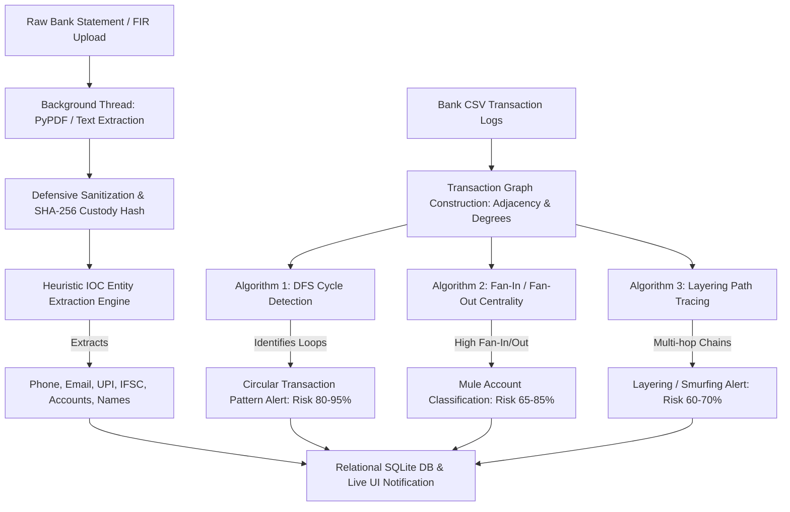

# CyberTrace AI: Comprehensive Technology Stack, Architecture & AI/ML Engineering Document

## Executive Summary
**CyberTrace AI** is an advanced, enterprise-grade digital investigation and threat intelligence portal tailored specifically for Law Enforcement Agencies (LEAs), Cyber Cells (e.g., Ahmedabad CCB, Surat Cyber Cell), and citizens (`1930 / I4C` ecosystem). The platform combines **explainable graph analytics**, **automated OCR & IOC (Indicator of Compromise) entity extraction**, and **trilingual localization (`EN`, `HI`, `GU`)** into a highly secure, non-blocking full-stack web application.

This document details the exact **Technology Stack**, the **Use Cases & Rationale** behind every tool and framework, and the **AI / ML / Algorithmic Engines** embedded within the system.

---

## 1. Complete Technology Stack & Engineering Rationale

### A. Frontend Technology Stack (`front-end/package.json`)

| Technology / Library | Version | Use Case in CyberTrace AI | Engineering Rationale & Justification |
| :--- | :--- | :--- | :--- |
| **React** | `^18.3.1` | Core UI library driving all 8 SPA pages (`Dashboard`, `CaseDetail`, `Analytics`, `CitizenPortal`, `Settings`, `CasesList`, `AuditLog`, `Login`). | Provides a declarative, component-based rendering pipeline with virtual DOM efficiency, ensuring instant UI updates during live data ingestion. |
| **TypeScript** | `^5.6.3` | Static typing enforcement across all components, state stores, API payloads (`types/index.ts`), and i18n keys. | Eliminates runtime type errors, enforces strict API contracts between frontend and backend, and guarantees safe refactoring across complex data models (`GraphNode`, `FraudAlert`, `Case`). |
| **Vite** | `^5.4.11` | Build tool and Hot Module Replacement (HMR) development server (`vite.config.ts`). | Delivers sub-second cold starts and instantaneous HMR updates via native ES modules (`@vitejs/plugin-react`), speeding up iterative UI development. |
| **Zustand** | `^5.0.1` | Global client-side state management (`caseStore.ts`, `authStore.ts`, `themeStore.ts`). | Lightweight, hook-based state container that avoids React Context boilerplate and unnecessary re-renders. Manages active cases, entity filters, fraud alerts, and multi-tab sync across the portal. |
| **React Router DOM** | `^6.26.2` | Client-side routing and URL parameter parsing (`/cases/:id`, `/analytics`, `/portal`, etc.). | Enables seamless SPA navigation with nested routes and breadcrumb history tracking without triggering full page reloads. |
| **react-i18next / i18next** | `^15.1.0` / `^23.16.4` | Full-application Trilingual Localization (**English `en`**, **Hindi `hi`**, and **Gujarati `gu`**) with `i18next-browser-languagedetector`. | Critical for Indian law enforcement and citizen accessibility. Dynamically switches UI labels, modals, table headers, and status messages without page refreshes while persisting language choices in `localStorage`. |
| **react-force-graph-2d** | `^1.27.0` | 2D Physics-based Graph Visualization in `MoneyTrailTab.tsx`. | Renders interactive, highly responsive node-link network diagrams powered by HTML5 Canvas. Allows investigating officers to zoom, pan, drag nodes, and inspect money laundering flows without DOM lag. |
| **Recharts** | `^2.13.3` | Statistical Data Visualization in `DashboardPage.tsx` and `AnalyticsPage.tsx`. | SVG-based charting library tailored for React. Displays live crime typology distributions, financial loss trends, and district heatmap risk metrics with smooth animation curves. |
| **Framer Motion** | `^11.11.11` | UI transitions, micro-animations, modal portals (`AnimatePresence`), and risk gauge animations. | Creates an engaging, modern "glassmorphism" visual experience with fluid layout shifts (`layout` prop) that clearly signal system status changes (e.g., alert acceptance or file upload). |
| **Lucide React** | `^0.454.0` | Unified vector icon system across navbar, sidebar, status badges, and alert cards. | Clean, tree-shakeable SVG icon set ensuring crisp, scalable iconography on high-DPI displays while keeping bundle sizes minimal. |
| **Tailwind CSS / PostCSS** | `^3.4.14` / `^8.4.47` | Utility-first CSS styling system combined with custom design system tokens (`index.css`). | Enables rapid UI styling with customized dark-mode palettes (`bg-[#0A1128]`, border gradients) and responsive grid layouts. |
| **clsx** | `^2.1.1` | Conditional utility class construction. | Safely constructs dynamic CSS classes based on state variables (e.g., highlighting `Suspicious` transactions in red vs. normal transactions). |

---

### B. Backend Technology Stack (`backend/requirements.txt` & Python Modules)

| Technology / Library | Version | Use Case in CyberTrace AI | Engineering Rationale & Justification |
| :--- | :--- | :--- | :--- |
| **Python** | `3.10+` | Core backend server language (`main.py`, `analysis.py`, `database.py`). | Industry standard for data analysis, string manipulation, regular expression parsing, and algorithmic graph traversals. |
| **Flask** | `3.0.3` | Lightweight WSGI REST API web application framework (`@app.route`). | Provides minimal, unopinionated routing and JSON serialization (`jsonify`) with clean HTTP request handling and cross-origin CORS support. |
| **SQLite3** | Native (`sqlite3`) | Relational database engine storing cases, entities, evidence, transactions, fraud alerts, and audit logs. | Serverless, zero-configuration ACID-compliant database embedded directly within the application (`cybertrace.db`). Guarantees portable, reliable data storage with parameterized query execution. |
| **PyPDF** | `4.2.0` | Document parsing library (`PdfReader`) for FIR documents and bank statements. | Safely extracts raw text from binary PDF evidence uploads within background threads without requiring external C/C++ dependencies or external OCR servers. |
| **Python `threading`** | Native (`threading.Thread`) | Asynchronous background execution (`process_ocr_task`). | Offloads CPU-bound OCR text extraction and IOC entity parsing from the main Flask request loop, returning immediate `200 OK` responses to the frontend while files process concurrently. |
| **Python `hashlib` & `re`** | Native | Chain of Custody SHA-256 hash generation and Regex-based heuristic IOC pattern matching. | Guarantees cryptographic verification of uploaded digital evidence against tampering while executing high-speed, defensive text scanning. |

---

## 2. AI / ML & Algorithmic Intelligence Architecture

Instead of relying on opaque "black-box" generative LLMs that can hallucinate financial indicators or require external cloud calls, **CyberTrace AI implements an Explainable, Algorithmic Graph Intelligence & Heuristic AI Engine (`backend/app/analysis.py`)**. This ensures 100% data sovereignty, deterministic accuracy, and courtroom-admissible evidence.

### A. Algorithmic Graph Intelligence (`analyze_transaction_graph`)

The backend builds a directed graph $G = (V, E)$ from imported bank transaction logs, where vertices $V$ represent bank/crypto/UPI accounts and directed edges $E$ represent financial transfers weighted by transaction amount and timestamp.

#### 1. Depth-First Search (DFS) Cycle Detection (Money Laundering Loops)
* **Algorithm / Logic**: Implements a colored graph traversal (`0 = unvisited, 1 = visiting, 2 = visited`) with parent tracking (`find_cycles_dfs`) to detect circular subgraphs (`A -> B -> C -> A`).
* **Use Case & Rationale**: Criminals frequently route stolen funds through multiple intermediate shell accounts in a loop to confuse traditional bank auditors and generate fake transaction volumes.
* **Result**: Automatically emits a **`Circular Transaction Pattern`** Alert (`risk_score = 80.0`, `ai_confidence = 0.88`) and flags all participating links (`circular = True`) in the visual money trail graph.

#### 2. Directed Graph Centrality & Mule Account Classification
* **Algorithm / Logic**: Computes exact directed node centralities:
  $$\text{Fan-In}(v) = |\{u \in V \mid (u, v) \in E\}|, \quad \text{Fan-Out}(v) = |\{w \in V \mid (v, w) \in E\}|$$
* **Use Case & Rationale**:
  * **Mule Accounts (`mule`)**: Nodes with $\text{Fan-In} \ge 2$ and $\text{Fan-Out} \ge 2$ (or high throughput aggregation followed by rapid dispersion to cash out/crypto endpoints). Automatically assigned **Risk Score `65 - 85/100`**.
  * **Final Beneficiaries (`beneficiary`)**: Nodes receiving funds ($\text{Fan-In} \ge 1$) with zero subsequent outgoing transfers ($\text{Fan-Out} = 0$). Assigned **Risk Score `75/100`**.
* **Result**: Emits a **`Mule Account Detected`** Critical Alert (`ai_confidence = 0.92`) and colors nodes dynamically (`Red` for mules, `Orange` for beneficiaries, `Blue` for victims).

#### 3. Layering & Smurfing Path Tracing (`find_paths`)
* **Algorithm / Logic**: Performs bounded recursive path exploration starting from known complainant/victim IOC nodes to discover sequential transfer chains of length $L \ge 3$.
* **Use Case & Rationale**: Detects "smurfing" strategies where funds are rapidly sliced across multiple accounts across jurisdictions immediately after a fraud incident.
* **Result**: Emits a **`Layering Pattern (Fund Smurfing)`** Alert (`risk_score = 70.0`, `ai_confidence = 0.85`).

---

### B. Heuristic & NLP Entity Extraction (`extract_entities_from_text`)

When digital evidence (PDF/CSV/TXT) is ingested, the **Automated Entity Extraction Engine** parses raw unstructured text using multi-layered pattern recognition:

1. **Indian Mobile Numbers (`phone`)**: Regex `(?:\+91[\s-]?)?[6-9]\d{4}[\s-]?\d{5}\b`. Assigns **99% confidence** if prefixed with `+91`.
2. **Email Addresses (`email`)**: Regex `[a-zA-Z0-9._%+-]+@[a-zA-Z0-9.-]+\.[a-zA-Z]{2,}` (**98% confidence**).
3. **UPI Virtual Payment Addresses (`upi`)**: Regex `[a-zA-Z0-9._-]+@[a-zA-Z]{3,}` while filtering out standard email domain extensions (`.com`, `.org`, `.in`) (**94% confidence**).
4. **Bank Account Numbers (`account`)**: Context-Aware Regex `\b\d{9,18}\b`. Inspects a $\pm 30$-character window around candidate digits for banking context keywords (`acc`, `account`, `खाता`, `संख्या`, `no`, `number`), boosting confidence from `85%` to **95%**.
5. **IFSC Codes (`ifsc`)**: Enforces Reserve Bank of India format `\b[A-Z]{4}0[A-Z0-9]{6}\b` (**99% confidence**).
6. **Person Names (`person`)**: Pattern extraction matching structured FIR headers (`complainant name:`, `accused:`, `शिकायतकर्ता का नाम:`) (**88% confidence**).

---

## 3. Secure Software Engineering Practices

CyberTrace AI adheres strictly to secure coding guidelines to prevent vulnerabilities:
* **Parameterized Queries**: 100% of SQL queries in `database.py` and `main.py` utilize tuple parameter binding (`execute("SELECT ... WHERE id = ?", (id,))`) to eliminate SQL Injection (SQLi).
* **Cryptographic Chain of Custody**: Every uploaded file immediately generates a `SHA-256` digest (`compute_sha256`), stored alongside file records to guarantee courtroom integrity.
* **Defensive Input Sanitization & Path Traversal Prevention**:
  * `secure_filename()` combined with strict path prefix assertions (`os.path.abspath(file_path).startswith(...)`) blocks directory traversal (`../../etc/passwd`) attacks.
  * `sanitize_string()` strips `<script>` tags and HTML entities to prevent Cross-Site Scripting (XSS).
* **Immutable Audit Logging**: Every sensitive officer action (`CASE_CREATED`, `EVIDENCE_UPLOADED`, `ALERT_ACCEPTED`) is recorded in the `audit_logs` table with timestamp, officer username, IP address, and details.
